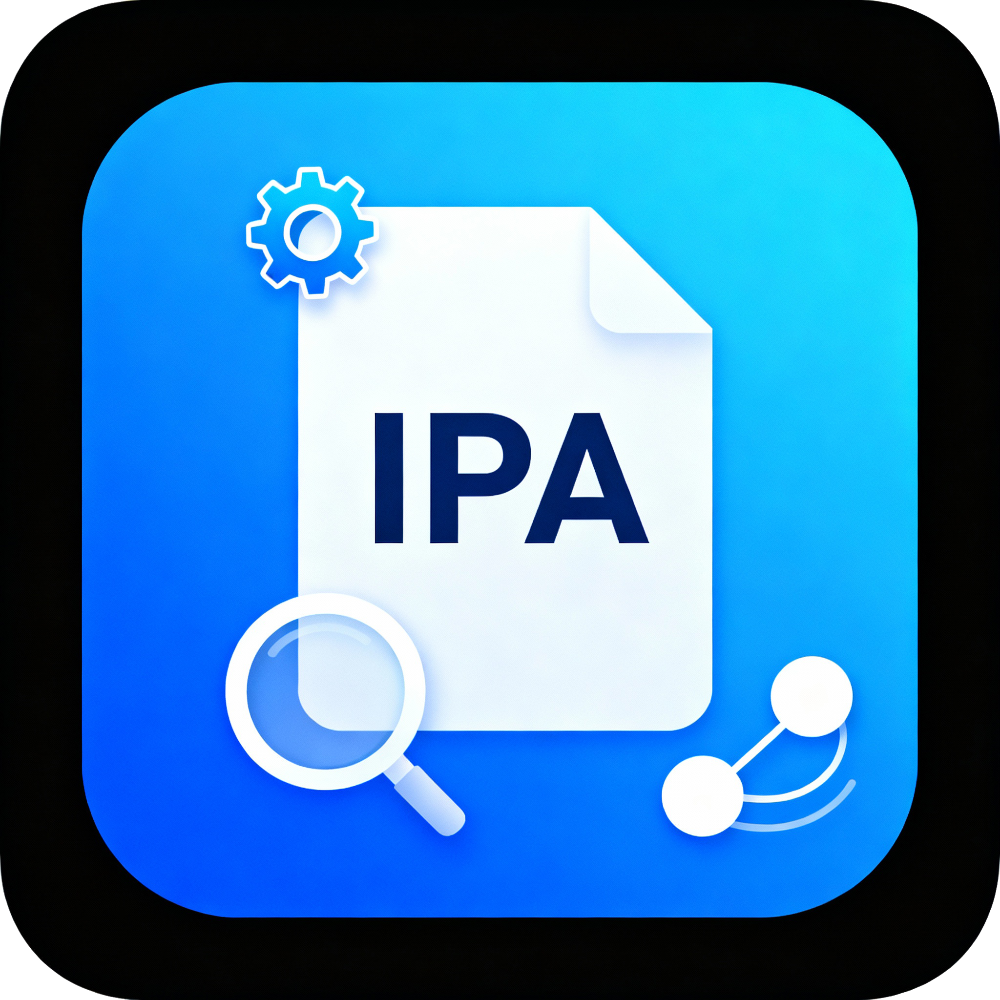

# GetURLScheme

## 简介
GetURLScheme 是一个可自动解析 IPA 文件、提取其中 URL Scheme 的工具。

## 主要功能
- 解析 IPA 文件，提取 CFBundleURLSchemes 信息

## 作者
[Brandonjhd](https://github.com/Brandonjhd)

## License
本项目采用 [CC BY-NC-SA 4.0](https://creativecommons.org/licenses/by-nc-sa/4.0/deed.zh) 协议开源，使用、引用及分享时需署名，不得用于商业用途，衍生作品须采用相同协议共享。
###请注意：
- 本项目仅允许开源学习及个人非商业用途
- 未经作者明确授权，禁止用于任何商业用途
- 使用本项目时，请务必保留署名及本仓库出处：https://github.com/Brandonjhd/GetURLScheme

---

如果您有问题或建议，请在 Issues 中提出。感谢使用！
